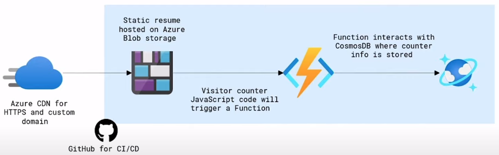

# Azure Resume Deployment

## Overview
This project deploys a static resume on Azure using Blob Storage, Functions, CosmosDB, and automated deployment with GitHub Actions.

## Technologies Used
- **Azure Blob Storage:** For hosting the static resume.
- **Azure Functions:** Triggered by visitor counter JavaScript code to interact with CosmosDB.
- **CosmosDB:** Where the visitor counter info is stored.
- **GitHub Actions:** For CI/CD.

## Architecture
The static resume is hosted on Azure Blob storage and utilizes Azure CDN for HTTPS and custom domain. The visitor counter is implemented using JavaScript code that triggers an Azure Function. This function interacts with CosmosDB where the counter info is stored. The entire deployment process is automated using GitHub Actions for CI/CD.

## Credits
For this project I followed the following video from A Cloud Guru, shoutout to them for providing such useful content for free.
[Youtube video](https://www.youtube.com/watch?v=ieYrBWmkfno&ab_channel=ACloudGuru)